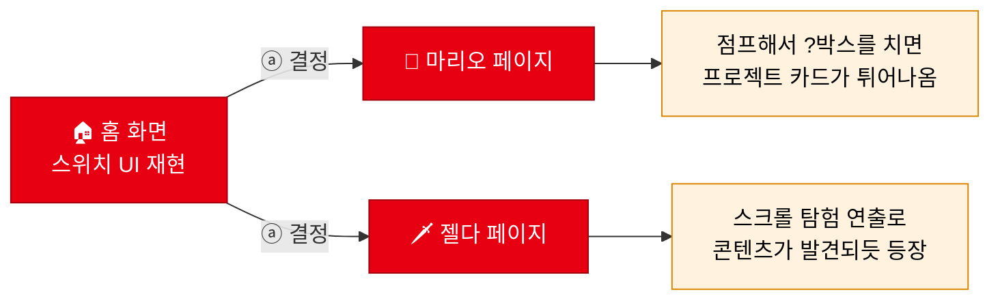

<div align="center">

# 🎮 nintendo-switch-web

### 닌텐도 스위치 홈 화면을 **웹으로 재현하고**, 게임별 페이지가 **인게임처럼** 프로젝트를 보여주는 사이트

<br/>


<br/>


</div>

---

> ## 🚧 이 repo는 지금 **전면 개편 중**입니다
>
> 초기 버전은 프론트엔드를 배우던 시기에 만든 것이라, 스위치 컨셉이 "비슷한 분위기" 수준에 머물렀고
> 수업 실습 파일들이 같은 repo에 섞여 있었습니다.
>
> **지금은 컨셉부터 다시 잡아 리메이크하는 중입니다.** 무엇을 어떻게 바꿀지는 아래에 적어뒀습니다.
> 진행 상황과 결과물은 이 README에서 계속 갱신됩니다.
>
> 📄 상세 컨셉 문서 → [`docs/CONCEPT.md`](./docs/CONCEPT.md)

---

## 무엇을 만들고 있나

**"스위치 홈 화면을 아는 사람이 보면 바로 알아볼 정확도"** 를 목표로 합니다.
분위기만 흉내 내는 게 아니라, 실제 UI의 치수·간격·모션까지 재현하는 것이 이 프로젝트의 과제입니다.



### 홈 화면 — 재현 목표

- 상단 상태바 (프로필 아이콘 · 시간 · Wi-Fi · 배터리)
- 게임 카드 행 — 크기·간격·둥근 모서리 비율까지. **포커스 시 컬러 테두리 하이라이트 + 살짝 확대 + 타이틀 표시**
- 하단 버튼 가이드 (ⓐ 결정 / ⓑ 뒤로) · 하단 아이콘 메뉴 (뉴스·샵·앨범·설정 → **포트폴리오 메뉴로 치환**)
- 방향키 / 마우스로 카드 포커스 이동, ⓐ(클릭·Enter)로 페이지 진입

### 게임별 페이지 — "소개 페이지"가 아니라 "인게임 화면"

| 페이지 | 살릴 아이덴티티 | 핵심 인터랙션 |
| --- | --- | --- |
| 🍄 **마리오** | 지상 스테이지 사이드뷰 (하늘·언덕·파이프·벽돌) | **마리오를 조작(←→ / Space)해 점프로 `?박스`를 치면 프로젝트 카드가 튀어나옴.** 박스 개수 = 프로젝트 개수, 친 박스는 빈 박스로, 코인 카운터 연동 |
| 🗡️ **젤다** | 탐험 · 발견의 분위기 | 스크롤 탐험 연출로 콘텐츠가 발견되듯 나타남 |

> **페이지당 핵심 인터랙션은 딱 하나.** 어설픈 효과를 여러 개 붙이는 것보다, 하나를 매끈하게 만드는 쪽을 택했습니다.

---

## 에셋 원칙 — 공식 이미지를 쓰지 않습니다

이 프로젝트의 **기술적 도전이자 어필 포인트**입니다.

| | |
| --- | --- |
| ✅ **참고는 자유** | Figma 커뮤니티의 Switch UI 킷 · 실기 스크린샷 · 인게임 영상을 **치수·색·모션 레퍼런스로만** 사용 |
| ✅ **커밋은 자체 제작만** | repo에 들어가는 에셋은 직접 만든 **CSS · SVG · Canvas**만 |
| ❌ **금지** | 닌텐도 공식 이미지 · 스프라이트 · 음원 · 영상 커밋 |
| ❌ **금지** | 유튜브 등 외부 콘텐츠 임베드로 때우기 |

**왜 이렇게 하나** — 공식 에셋을 가져다 쓰면 "이미지를 배치한 것"이지 만든 게 아닙니다.
마리오의 `?박스`도, 스위치 홈의 카드 하이라이트도 **CSS와 SVG로 직접 그리는 것**이 이 프로젝트에서 보여주고 싶은 것입니다.

---

## 개편 로드맵

| 단계 | 내용 | 상태 |
| :--: | --- | :--: |
| 1 | **실습 파일 분리** — 수업 실습물(`grid생식`·`회원가입`·`갤럭시워치`·`trans실습` 등)을 repo 밖으로 | 🔄 진행 중 |
| 2 | **면접관 진단 + before 캡처** — 현재 상태를 기록해 남김 | ⬜ |
| 3 | **홈 화면 리메이크** — 스위치 UI 정밀 재현 | ⬜ |
| 4 | **마리오 페이지** — `?박스` 인터랙션 (현행 "박스 그리드 나열"은 폐기) | ⬜ |
| 5 | **젤다 페이지** — 스크롤 탐험 연출 (영상 배경 → 직접 구현으로 교체) | ⬜ |
| 6 | **before / after 비교** + GitHub Pages 재배포 | ⬜ |

---

## 현재 repo 상태 (정직하게)

개편 1단계가 끝나기 전이라, 지금 repo에는 **수업 실습 파일이 함께 들어 있습니다.**

```
nintendo-switch-web/
├── index.html            # 스위치 홈 화면 (구버전 — 개편 대상)
├── docs/CONCEPT.md       # ★ 개편 컨셉 문서
│
├── grid생식.html          # ┐
├── 회원가입.html           # │ 수업 실습물
├── 갤럭시워치.html         # │ (개편 1단계에서 repo 밖으로 분리 예정)
├── trans실습.html          # │
├── video실습.html          # │
├── 사진grid.html           # │
├── 젤다응용실습.html        # │
├── summerrecord.html      # │
└── Mobilefirst/           # ┘
```

**왜 아직 안 지웠나** — 개편 진단에서 *살릴 것 / 버릴 것* 을 분류한 뒤에 정리하려고 남겨뒀습니다.
먼저 지우면 무엇을 참고했는지 대조할 수 없습니다.

---

## 비상업 팬 프로젝트 고지

이 프로젝트는 **학습 목적의 비상업 팬 프로젝트**입니다.
Nintendo, Nintendo Switch, Super Mario, The Legend of Zelda는 **Nintendo Co., Ltd.의 상표**이며, 이 프로젝트는 Nintendo와 아무런 관련이 없습니다.

repo에 포함된 에셋은 **모두 직접 제작한 것**이며, 공식 에셋은 커밋하지 않습니다.

---

<div align="center">
<sub>

**조아진** · [GitHub](https://github.com/lastsummer0830) · lastsummer0830@gmail.com

</sub>
</div>
